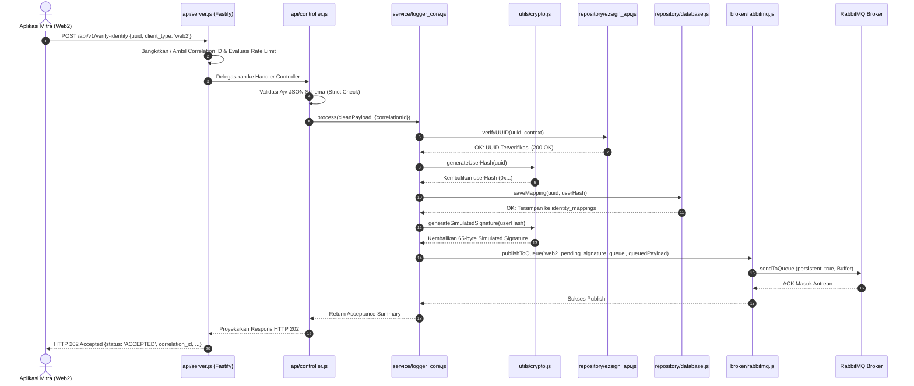
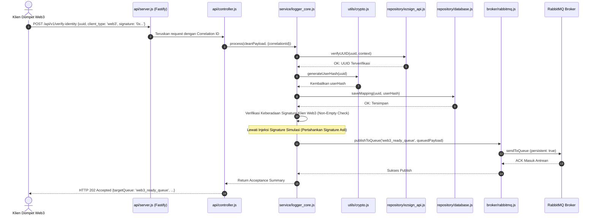
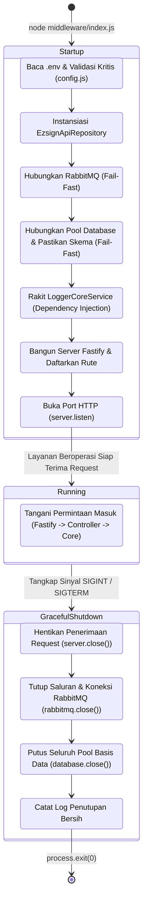

# DOKUMENTASI TEKNIS ARSITEKTUR, KEBUTUHAN SISTEM, DAN ALUR MODUL MIDDLEWARE
**Sistem Pencatatan Audit Asinkron ezSign Core Domain**

---

## DAFTAR ISI
1. [Ringkasan Eksekutif & Domain Sistem](#1-ringkasan-eksekutif--domain-sistem)
2. [Kebutuhan Sistem Menyeluruh (System Requirements)](#2-kebutuhan-sistem-menyeluruh-system-requirements)
   - [2.1 Kebutuhan Fungsional (Functional Requirements)](#21-kebutuhan-fungsional-functional-requirements)
   - [2.2 Kebutuhan Non-Fungsional & Standar Metrik (FUN-01)](#22-kebutuhan-non-fungsional--standar-metrik-fun-01)
   - [2.3 Kebutuhan Keamanan Data & Privasi](#23-kebutuhan-keamanan-data--privasi)
   - [2.4 Kebutuhan Lingkungan & Dependensi Teknologi](#24-kebutuhan-lingkungan--dependensi-teknologi)
3. [Struktur Direktori & Dekomposisi Komponen](#3-struktur-direktori--dekomposisi-komponen)
4. [Dokumentasi Teknis Rinci Per Folder dan Berkas](#4-dokumentasi-teknis-rinci-per-folder-dan-berkas)
   - [4.1 Folder `src/api` (Lapisan Presentasi & HTTP Gateway)](#41-folder-srcapi-lapisan-presentasi--http-gateway)
     - [`src/api/server.js`](#srcapiserverjs)
     - [`src/api/controller.js`](#srcapicontrollerjs)
   - [4.2 Folder `src/broker` (Lapisan Pesan Asinkron)](#42-folder-srcbroker-lapisan-pesan-asinkron)
     - [`src/broker/rabbitmq.js`](#srcbrokerrabbitmqjs)
   - [4.3 Folder `src/repository` (Lapisan Akses Data & Integrasi Eksternal)](#43-folder-srcrepository-lapisan-akses-data--integrasi-eksternal)
     - [`src/repository/database.js`](#srcrepositorydatabasejs)
     - [`src/repository/ezsign_api.js`](#srcrepositoryezsign_apijs)
   - [4.4 Folder `src/service` (Lapisan Logika Bisnis Utama)](#44-folder-srcservice-lapisan-logika-bisnis-utama)
     - [`src/service/logger_core.js`](#srcservicelogger_corejs)
   - [4.5 Folder `src/utils` (Lapisan Utilitas & Konfigurasi Lintas Modul)](#45-folder-srcutils-lapisan-utilitas--konfigurasi-lintas-modul)
     - [`src/utils/config.js`](#srcutilsconfigjs)
     - [`src/utils/crypto.js`](#srcutilscryptojs)
     - [`src/utils/errors.js`](#srcutilserrorsjs)
   - [4.6 Berkas Orkestrator Utama: `middleware/index.js`](#46-berkas-orkestrator-utama-middlewareindexjs)
5. [Alur Komunikasi Antar-Berkas & Diagram Interaksi (Inter-File Flows)](#5-alur-komunikasi-antar-berkas--diagram-interaksi-inter-file-flows)
   - [5.1 Diagram Ketergantungan Komponen (Component Dependency Graph)](#51-diagram-ketergantungan-komponen-component-dependency-graph)
   - [5.2 Alur Pemrosesan Klien Web2 (End-to-End Web2 Flow)](#52-alur-pemrosesan-klien-web2-end-to-end-web2-flow)
   - [5.3 Alur Pemrosesan Klien Web3 (End-to-End Web3 Flow)](#53-alur-pemrosesan-klien-web3-end-to-end-web3-flow)
   - [5.4 Alur Penanganan Galat & Isolasi Kegagalan (Error & Fail-Fast Flow)](#54-alur-penanganan-galat--isolasi-kegagalan-error--fail-fast-flow)
   - [5.5 Alur Siklus Hidup: Inisialisasi & Graceful Shutdown](#55-alur-siklus-hidup-inisialisasi--graceful-shutdown)
6. [Kontrak Data, Skema JSON, dan Definisi Antrean](#6-kontrak-data-skema-json-dan-definisi-antrean)
   - [6.1 Skema Permintaan HTTP (Request Contracts)](#61-skema-permintaan-http-request-contracts)
   - [6.2 Skema Respons HTTP (Response Contracts)](#62-skema-respons-http-response-contracts)
   - [6.3 Skema Relasional Basis Data (`identity_mappings`)](#63-skema-relasional-basis-data-identity_mappings)
   - [6.4 Format Payload Antrean RabbitMQ (`QueuedPayload`)](#64-format-payload-antrean-rabbitmq-queuedpayload)
7. [Matriks Variabel Lingkungan & Konfigurasi (.env)](#7-matriks-variabel-lingkungan--konfigurasi-env)
8. [Panduan Operasional & Pemeliharaan](#8-panduan-operasional--pemeliharaan)

---

## 1. Ringkasan Eksekutif & Domain Sistem

Komponen **Middleware (Logging Backend API)** beroperasi pada lapisan **Web2 Core Domain** di dalam arsitektur platform pencatatan audit digital ezSign. Dalam arsitektur sistem berskala besar, Middleware bertindak sebagai titik tumpu (*fulcrum*) yang menjembatani lalu lintas sinkron dari aplikasi mitra/klien konvensional (Web2) maupun terdesentralisasi (Web3) menuju infrastruktur pencatatan terdistribusi berbasis blockchain (*Web3 Domain* / Hyperledger Besu) yang dieksekusi secara asinkron oleh komponen pendamping (*TX-Worker*).

Tujuan fundamental dari Middleware ini adalah:
1. **Pemisahan Beban (*Decoupling*)**: Mengisolasi pemrosesan HTTP berkecepatan tinggi dari latensi konsensus blockchain yang memakan waktu detik hingga menit.
2. **Penjangkaran Identitas Terproteksi Privasi (*Privacy-Preserving Identity Anchoring*)**: Menerapkan pseudonimisasi identitas mutlak sehingga tidak ada sedikit pun data pribadi yang dapat diidentifikasi (*Personally Identifiable Information* / PII) yang bocor ke jaringan publik maupun *ledger* blockchain.
3. **Penjamin Kredensial Multi-Klien (*Multi-Client Credential Broker*)**: Menyediakan diferensiasi perlakuan (*branching logic*) antara klien Web2 (tanpa dompet digital) dan klien Web3 (pemegang *private key* mandiri).

```
+-------------------------------------------------------------------------------+
|                             WEB2 CORE DOMAIN                                  |
|                                                                               |
|  +--------------------+                                                       |
|  |  Mitra / Klien     |                                                       |
|  |  (Web2 / Web3)     |                                                       |
|  +---------+----------+                                                       |
|            |                                                                  |
|            | HTTP POST (JSON Payload + Correlation ID)                        |
|            v                                                                  |
|  +-------------------------------------------------------------------------+  |
|  |                      MIDDLEWARE (Logging Backend API)                   |  |
|  |                                                                         |  |
|  |  [api/server.js]        --> Fastify Gateway (CORS, RateLimit, Tracking) |  |
|  |  [api/controller.js]    --> Strict Ajv Schema Validation                |  |
|  |  [service/logger_core]  --> Orchestrator Logika Bisnis & PII Stripping  |  |
|  |  [repository/ezsign]    --> Verifikasi UUID Sinkron ke Backend ezSign   |  |
|  |  [repository/database]  --> Persistensi Relasi UUID <=> User_Hash (SQL) |  |
|  |  [utils/crypto.js]      --> HMAC-SHA256 Pseudonimisasi & Web2 Sign      |  |
|  |  [broker/rabbitmq.js]   --> Channel Reuse & Durable Queue Transceiver   |  |
|  +--------------------+------------------------------------+---------------+  |
+-----------------------|------------------------------------|------------------+
                        |                                    |
          (web2_pending_signature_queue)       (web3_ready_queue)
                        |                                    |
+-----------------------v------------------------------------v------------------+
|                            WEB3 & LOGGING DOMAIN                              |
|                                                                               |
|  +--------------------+                                    +---------------+  |
|  | TX-Worker Pool     | <----------------------------------+ RPC Besu Node |  |
|  | (Vault KMS Signing)|                                    | (Audit Log)   |  |
|  +--------------------+                                    +---------------+  |
+-------------------------------------------------------------------------------+
```

---

## 2. Kebutuhan Sistem Menyeluruh (System Requirements)

Middleware dirancang dengan spesifikasi rekayasa perangkat lunak ketat yang mencakup kebutuhan fungsional, non-fungsional, standar keamanan, dan batasan infrastruktur.

### 2.1 Kebutuhan Fungsional (Functional Requirements)

1. **Titik Masuk Terstandardisasi (API Gateway Ingestion)**:
   - Sistem wajib menyediakan endpoint HTTP RESTful (`POST /api/v1/verify-identity` dan alias `POST /api/v1/log`) untuk menerima permintaan pencatatan log audit dari aplikasi klien Web2 maupun Web3.
   - Sistem wajib menolak permintaan secara instan pada gerbang pertama jika struktur payload tidak memenuhi skema JSON baku.

2. **Verifikasi Identitas Eksternal (External Identity Verification)**:
   - Sebelum payload diproses lebih lanjut, Middleware wajib memanggil antarmuka pemrograman backend ezSign Web2 lama untuk memastikan keabsahan dan keaktifan identitas universal pengguna (`UUID`).
   - Jika `UUID` tidak valid atau tidak terdaftar pada layanan ezSign lama, sistem wajib menolak permintaan dengan status HTTP 400 Bad Request.

3. **Pseudonimisasi Identitas (User Hash Generation)**:
   - Sistem wajib mengubah data mentah identitas pengguna (`UUID`) menjadi nilai pseudonim terenkripsi (`User_Hash`) berbasis representasi hexadesimal standar blockchain (`0x` prefixed, panjang 32-byte / 64 karakter hex).
   - Transformasi identitas wajib bersifat deterministik (menghasilkan hash yang identik untuk input UUID yang sama) namun searah (*irreversible*).

4. **Persistensi Pemetaan Relasional (Relational Identity Mapping)**:
   - Sistem wajib mencatat hubungan antara `UUID` mentah dengan `User_Hash` ke dalam penyimpanan basis data relasional internal (PostgreSQL atau MariaDB/MySQL).
   - Perekaman ini berfungsi sebagai acuan audit forensik internal terisolasi bagi pemilik platform jika sewaktu-waktu diperlukan rekonsiliasi legal.
   - Jika suatu `UUID` telah ada di dalam database, sistem harus memperbarui hash terkini tanpa menimbulkan galat *duplicate key*.

5. **Logika Percabangan Kredensial (Branching Logic Web2 vs Web3)**:
   - **Alur Klien Web2**: Pengguna Web2 tidak memiliki pasangan kunci kriptografis (*private key*). Middleware wajib bertindak sebagai **Penjamin Kredensial Web2** (*Web2 Credential Guarantor*) dengan membangkitkan tanda tangan kriptografis simulasi secara *server-side* pada data pengguna, lalu meneruskan pesan ke antrean `web2_pending_signature_queue` untuk kemudian ditandatangani ulang oleh *Wallet Pool* via KMS di TX-Worker.
   - **Alur Klien Web3**: Pengguna Web3 menandatangani muatan di sisi klien menggunakan dompet digital mandiri (seperti MetaMask/Web3 Wallet). Middleware wajib memverifikasi kehadiran atribut `signature`. Jika valid, Middleware langsung memasukkan pesan ke antrean `web3_ready_queue` tanpa melakukan penjaminan simulasi ulang.

6. **Respons Asinkron Cepat (Fast Asynchronous Response)**:
   - Setelah pesan berhasil divalidasi, dipetakan ke database, dan masuk ke antrean RabbitMQ, Middleware harus segera mengembalikan respons status HTTP 202 Accepted beserta informasi status pemrosesan awal dan pengidentifikasi korelasi (*Correlation ID*) kepada klien pemanggil.

---

### 2.2 Kebutuhan Non-Fungsional & Standar Metrik (FUN-01)

Implementasi Middleware wajib mematuhi parameter metrik pengujian baku **FUN-01** (*API Routing & Hashing*):

| Parameter Uji | Batasan Spesifikasi | Mekanisme Realisasi Teknis |
| :--- | :--- | :--- |
| **Proteksi Data Pribadi (PII)** | **0 Byte Data Mentah (Zero Leak)** menembus ke antrean RabbitMQ | Atribut `uuid`, `identityNumber`, `fullName`, dan PII lainnya dieliminasi sepenuhnya dari objek antrean. Hanya `userHash`, `docType`, `signature`, `timestamp`, dan `metadata` yang masuk antrean. |
| **Latensi Pemrosesan API** | **Total latensi sinkron < 500 ms** (Target eksekusi lokal: < 50 ms) | Fastify JIT schema compilation, koneksi persisten *Channel Reuse* RabbitMQ, *Connection Pooling* SQL, modul crypto sinkron, dan *hard timeout* Axios (100–200ms). |
| **Stabilitas Beban Konkuren** | **Tingkat Galat (*Error Rate*) 0%** pada lonjakan 1.000 permintaan konkuren | Arsitektur I/O non-blocking Node.js, Fastify micro-overhead HTTP pipeline, batas rate-limit memadai (5.000 req/min), dan *connection pool* terkelola. |
| **Keunikan Hash** | **Tingkat keunikan 100%**, deterministik, bebas tabrakan (*collision-free*) | Algoritma HMAC-SHA256 dengan *secret salt* 256-bit server-side. |
| **Keandalan Antrean (Durabilitas)** | Pesan tidak boleh hilang jika broker terhenti (*crash*) | Deklarasi antrean bersifat *durable* (`durable: true`) dan pengiriman pesan bertaraf persisten (`persistent: true` / *delivery mode 2*). |
| **Pemisahan Sumber Daya Klien** | Beban komputasi kriptografis jaringan dan gas fee pada klien adalah **Nol (0)** | Transaksi Web2 didelegasikan sepenuhnya ke TX-Worker dan jaringan blockchain *Zero-Gas*. |

---

### 2.3 Kebutuhan Keamanan Data & Privasi

1. **Pencegahan Injeksi SQL (*SQL Injection Prevention*)**:
   - Seluruh kueri basis data pada lapisan repositori wajib menggunakan *Prepared Statements* dan *Parameterized Queries* (`$1, $2` pada PostgreSQL atau `?, ?` pada MySQL). Penggabungan string SQL (*concatenation*) dilarang keras.
2. **Penyensoran Log Sensitif (*PII & Token Redaction*)**:
   - Modul logger sistem (Pino) wajib mengaktifkan konfigurasi *redaction* terotomatisasi untuk menyensor atribut sensitif seperti `req.headers.authorization`, `password`, `secret`, `*.secret`, dan `uuid` agar tidak tercetak pada media *stdout/stderr*.
3. **Penyembunyian Jejak Tumpukan Galat (*Stack Trace Masking*)**:
   - Global Error Handler wajib mencegat seluruh galat tak terduga (500) dan mengembalikan pesan netral kepada klien. Jejak tumpukan (*stack trace*) kode hanya boleh dicatat di log server internal dengan referensi `correlation_id` demi mencegah *information disclosure*.
4. **Proteksi Serangan Denial of Service (DoS Mitigation)**:
   - Gerbang API wajib dilindungi oleh komponen `@fastify/rate-limit` terpadu untuk membatasi lonjakan lalu lintas yang tidak wajar dari alamat IP tertentu.

---

### 2.4 Kebutuhan Lingkungan & Dependensi Teknologi

Sistem Middleware dibangun di atas tumpukan teknologi modern berkinerja tinggi:

- **Runtime**: Node.js versi 18 LTS ke atas (kompatibel dengan Node.js v20/v22/v23).
- **Format Modul**: CommonJS (`"type": "commonjs"`).
- **Kerangka HTTP**: Fastify v5 (menggantikan Express untuk performa throughput hingga 4x lebih tinggi).
- **Driver Message Broker**: `amqplib` (komunikasi protokol AMQP 0-9-1).
- **Driver Basis Data**: Dual-engine (`pg` untuk PostgreSQL, `mysql2` untuk MariaDB / MySQL).
- **Klien HTTP Eksternal**: `axios` dengan konfigurasi interseptor dan batas waktu ketat.
- **Pencatat Log Struktur**: `pino` (zero-overhead JSON structured logger non-blocking).
- **Pengelola Lingkungan**: `dotenv` untuk mengonsumsi berkas konfigurasi `.env`.

---

## 3. Struktur Direktori & Dekomposisi Komponen

Hierarki berkas pada modul Middleware menerapkan prinsip pemisahan tanggung jawab (*Separation of Concerns*) dan arsitektur berlapis (*Layered Clean Architecture*):

```text
middleware/
├── DOKUMENTASI_TEKNIS_MIDDLEWARE.md  # File dokumentasi komprehensif ini
├── index.js                           # Entry point sistem & Dependency Injection container
├── package.json                       # Konfigurasi package Node.js middleware
├── server.js                          # [Legacy] Prototipe Express lama (dipertahankan untuk referensi)
└── src/
    ├── api/                           # LAPISAN PRESENTASI & GATEWAY HTTP
    │   ├── controller.js              # Validasi skema Ajv, sanitasi input, pemetaan status HTTP
    │   └── server.js                  # Setup Fastify, plugin CORS, RateLimit, tracking, error handler
    ├── broker/                        # LAPISAN PESAN ASINKRON (MESSAGE BROKER)
    │   └── rabbitmq.js                # Koneksi AMQP, Channel Reuse, pengiriman pesan persisten
    ├── repository/                    # LAPISAN AKSES DATA & INTEGRASI EKSTERNAL
    │   ├── database.js                # Repository SQL (Postgres / MySQL), pool, prepared statements
    │   └── ezsign_api.js              # Klien HTTP Axios eksternal, validasi UUID dengan hard timeout
    ├── service/                       # LAPISAN LOGIKA BISNIS UTAMA (CORE DOMAIN)
    │   └── logger_core.js             # Orchestrator alur verifikasi, hashing, mapping, & queue routing
    └── utils/                         # LAPISAN UTILITAS & INFRASTRUKTUR SILANG
        ├── config.js                  # Pemuat konfigurasi .env & setup logger Pino
        ├── crypto.js                  # Generator HMAC-SHA256 User Hash & tanda tangan simulasi Web2
        └── errors.js                  # Hirarki class galat kustom terstandarisasi (AppError)
```

---

## 4. Dokumentasi Teknis Rinci Per Folder dan Berkas

Berikut adalah rincian teknis mendalam dari setiap berkas pada masing-masing folder modul.

---

### 4.1 Folder `src/api` (Lapisan Presentasi & HTTP Gateway)

Folder ini mengisolasi seluruh interaksi protokol HTTP dari klien luar. Dilarang keras menaruh logika bisnis langsung di lapisan ini.

#### `src/api/server.js`

* **Peran & Tanggung Jawab**:
  Mengonfigurasi dan menginisialisasi peladen web berbasis **Fastify v5**. Berkas ini bertindak sebagai kerangka pembungkus yang menyatukan plugin keamanan, pelacak siklus hidup request, middleware HTTP, dan perutean endpoint.
* **Fitur & Mekanisme Teknis**:
  1. **Konfigurasi Fastify Logger Serializer**: Memetakan atribut penting dari request (`method`, `url`, `hostname`, `remoteAddress`, dan `correlation_id`) tanpa mengekspos header atau body sensitif.
  2. **Pelacakan Correlation ID Universal (`genReqId`)**:
     - Memeriksa ketersediaan header `x-correlation-id` atau `x-request-id` dari klien pengirim.
     - Jika tidak tersedia, sistem membangkitkan UUID v4 baru secara instan menggunakan `crypto.randomUUID()`.
     - ID ini menjadi pengenal transaksi tunggal yang diikatkan ke seluruh log, query database, header broker, dan respons HTTP.
  3. **Hook Injeksi Header Respons (`onSend`)**:
     Menyuntikkan kembali `x-correlation-id` pada setiap header respons HTTP yang keluar ke klien agar klien dapat melacak tiket permintaannya secara presisi.
  4. **Plugin Keamanan CORS (`@fastify/cors`)**:
     Membuka izin lintas domain bagi aplikasi web mitra ezSign dengan metode HTTP yang diizinkan (`GET, POST, PUT, DELETE, OPTIONS`) dan otorisasi header khusus.
  5. **Plugin Pembatas Laju (`@fastify/rate-limit`)**:
     Mengamankan server dari lonjakan berlebih (default: 5.000 permintaan per menit). Jika terlampaui, mengembalikan status HTTP 429 Too Many Requests dengan format JSON terstruktur.
  6. **Penangan Galat Terpusat (*Global Error Handler*)**:
     - *Validation Error*: Mencegat galat validasi Ajv Fastify (`error.validation`) dan mengembalikan kode `FST_ERR_VALIDATION` dengan status HTTP 400 beserta rincian parameter yang salah.
     - *Client Error*: Mencegat status 400–499 dan meneruskannya secara aman.
     - *Internal Error*: Mencegat galat fatal 500, mencatat detail *stack trace* ke log internal server bersama `correlation_id`, namun **TIDAK PERNAH** membocorkan *stack trace* ke respons JSON pengguna demi memenuhi standar keamanan OWASP.
  7. **Rute Pemantauan (*Health Check Route*)**:
     Menyediakan endpoint `GET /health` yang mengembalikan status `UP`, cap waktu ISO, dan `correlation_id` dengan latensi di bawah 2 ms untuk kebutuhan *Liveness Probe* pada Kubernetes / Docker Swarm.
  8. **Registrasi Rute Bisnis**:
     Mendaftarkan handler rute dari `controller.js` dan menyematkan dependensi `loggerCore` via fitur dekorator Fastify (`server.decorate('loggerCore', options.loggerCore)`).
* **Fungsi Utama yang Diekspor**:
  - `buildServer(options)`: Factory function asinkron untuk membangun instansi Fastify server siap pakai (ideal untuk *unit testing* maupun *production*).
  - `startServer(options)`: Fungsi pembantu untuk memanggil `buildServer` dan mengeksekusi `server.listen` pada port dan host yang ditentukan.

---

#### `src/api/controller.js`

* **Peran & Tanggung Jawab**:
  Bertindak sebagai pintu gerbang penegakan skema data (*Schema Enforcement Gate*). Berkas ini menerima input mentah dari Fastify, menjalankan validasi deklaratif Ajv, membersihkan (*sanitizing*) input, meneruskan eksekusi ke lapisan `service/logger_core.js`, dan memproyeksikan kode status respons HTTP (202, 400, atau 500).
* **Aturan Desain Mutlak**:
  - **Zero Business Logic**: Dilarang melakukan komputasi kriptografis, kueri database, atau routing antrean di dalam controller.
  - **Fail-Fast Validation**: Tolak request di pintu masuk sebelum sumber daya memori dan I/O backend dialokasikan.
* **Skema Validasi JSON Ajv (`verifyIdentitySchema`)**:
  ```javascript
  const verifyIdentitySchema = {
    body: {
      type: 'object',
      required: ['uuid', 'client_type'],
      additionalProperties: true,
      properties: {
        uuid: { type: 'string', minLength: 1, pattern: '^\\S+$' },
        client_type: { type: 'string', enum: ['web2', 'web3'] },
        signature: { type: 'string' },
        docType: { type: 'string' },
        doc_type: { type: 'string' },
        metadata: { type: 'object' },
        timestamp: { anyOf: [{ type: 'integer' }, { type: 'string' }] }
      }
    }
  };
  ```
  *Penjelasan*: Kolom `uuid` wajib berupa string tanpa karakter spasi (`^\S+$`), dan `client_type` wajib bernilai tepat antara `'web2'` atau `'web3'`.
* **Fungsi & Logika Pemrosesan**:
  1. `isClientError(err)`: Fungsi predikat pembantu untuk mendeteksi apakah suatu galat merupakan kesalahan dari sisi klien (seperti `ValidationFailError`, HTTP 4xx, atau flag `isClientError === true`).
  2. `createController(injectedLoggerCore)`:
     - Mengembalikan objek controller dengan method `handleVerifyIdentity(request, reply)`.
     - Melakukan resolusi instansi service `LoggerCoreService` dari parameter injeksi atau dari dekorator peladen `request.server.loggerCore`. Jika tidak ditemukan, mengembalikan status 500 secara aman.
     - Menyusun objek bersih `cleanPayload`:
       - `uuid`: String yang telah di-*trim*.
       - `client_type`: Nilai terverifikasi (`'web2'` / `'web3'`).
       - `signature`: Nilai tanda tangan atau `null`.
       - `docType`: Memprioritaskan `docType`, cadangan ke `doc_type`, atau default ke `'KTP'`.
       - `metadata`: Objek metadata bebas atau `{}` kosong.
       - `timestamp`: Cap waktu Unix atau default ke `Math.floor(Date.now() / 1000)`.
     - Mengirimkan `cleanPayload` bersama konteks eksekusi `{ correlationId: request.id }` ke `loggerCore.process(...)`.
     - Jika sukses, mengembalikan respons HTTP **202 Accepted** dengan format data baku.
     - Jika terjadi `isClientError`, mengembalikan respons HTTP **400 Bad Request**.
     - Jika terjadi galat internal tak terduga, mencatat log via `request.log.error` dan mengembalikan respons HTTP **500 Internal Server Error**.
  3. `controllerRoutes(fastify, options)`:
     Mendaftarkan handler ke endpoint utama `POST /api/v1/verify-identity` serta endpoint alias `POST /api/v1/log`.

---

### 4.2 Folder `src/broker` (Lapisan Pesan Asinkron)

Folder ini bertanggung jawab mengelola seluruh interaksi dengan *Message Broker* RabbitMQ menggunakan protokol AMQP.

#### `src/broker/rabbitmq.js`

* **Peran & Tanggung Jawab**:
  Menyediakan klien RabbitMQ yang tangguh (*resilient*), berkinerja tinggi, dan persisten untuk mendelegasikan payload pencatatan audit ke *TX-Worker*.
* **Pola Desain Kritis yang Diterapkan**:
  1. **Pola Penggunaan Ulang Saluran (*Channel Reuse Pattern*)**:
     Membuka koneksi TCP (`connection`) dan saluran AMQP (`channel`) baru pada setiap HTTP request merupakan tindakan anti-pola yang dapat merusak performa (memakan waktu handshake puluhan milidetik dan membebani file descriptors OS). `RabbitMQBroker` membuka koneksi dan saluran satu kali saat inisiasi, lalu menyimpannya di memori untuk digunakan secara simultan oleh ribuan permintaan konkuren.
  2. **Penguncian Konkurensi Koneksi (*Connection Mutex / Guard*)**:
     Jika banyak permintaan datang saat status koneksi sedang dibangun, variabel `isConnecting` mencegah terbentuknya pemanggilan `amqp.connect` ganda secara bersamaan. Permintaan lain akan menunggu secara asinkron hingga saluran pertama siap.
  3. **Cache Deklarasi Antrean (*Queue Assertion Cache*)**:
     Menggunakan `Set` internal (`this.assertedQueues`) untuk mengingat antrean apa saja yang sudah dideklarasikan ke broker RabbitMQ. Hal ini mengeliminasi *network round-trip overhead* dari pemanggilan `channel.assertQueue` yang redundan pada request berikutnya.
  4. **Penanganan Auto-Reset & Pemulihan Koneksi (*Event-Driven State Reset*)**:
     Mengikat event listener pada `connection.on('error')`, `connection.on('close')`, `channel.on('error')`, dan `channel.on('close')`. Jika koneksi terputus, status instansi di-reset ke `null` sehingga pemanggilan berikutnya secara otomatis mencoba rekoneksi transparan.
  5. **Jaminan Durabilitas & Persistensi Pesan**:
     - Antrean selalu dideklarasikan dengan konfigurasi `{ durable: true }` (antrean tetap hidup walau broker RabbitMQ di-restart).
     - Pesan selalu dikirim dengan opsi `{ persistent: true }` (Delivery Mode 2, RabbitMQ menulis pesan ke media penyimpanan/disk).
  6. **Serialisasi Buffer Adaptif**:
     Fungsi pengiriman mendukung deteksi tipe payload dinamis. Objek JavaScript otomatis diserialisasi menjadi representasi `Buffer` berbasis JSON UTF-8.
* **Metode-Metode Utama Class `RabbitMQBroker`**:
  - `constructor(url)`: Menginisialisasi URL target dan status internal saluran.
  - `async connect()`: Membuka koneksi TCP dan saluran AMQP berstatus singleton aktif.
  - `async publishToQueue(queueName, payload, options = {})`: Memastikan koneksi aktif, mendeklarasikan antrean jika belum tercatat di cache, mengubah payload menjadi Buffer, dan mempublikasikan pesan dengan header opsional (seperti `correlationId` dan `clientType`).
  - `async close()`: Menutup saluran dan koneksi secara tertib saat proses aplikasi dihentikan (*graceful shutdown*).
* **Ekspor**:
  Mengekspor instansi tunggal (*default singleton*) `defaultBroker` dan deklarasi class `RabbitMQBroker` untuk pengujian independen.

---

### 4.3 Folder `src/repository` (Lapisan Akses Data & Integrasi Eksternal)

Folder ini menangani seluruh komunikasi ke sistem penyimpanan basis data persisten dan API eksternal pihak ketiga.

#### `src/repository/database.js`

* **Peran & Tanggung Jawab**:
  Mengelola lapisan persistensi relasional untuk mencatat pemetaan identitas asli pengguna (`UUID`) terhadap nilai hash terlindung (`User_Hash`). Berkas ini menjamin bahwa seluruh rekonsiliasi data audit tersimpan secara konsisten dan aman dari serangan siber.
* **Fitur & Mekanisme Teknis**:
  1. **Dukungan Multi-Dialek Dinamis (PostgreSQL & MariaDB/MySQL)**:
     Sistem secara otomatis mendeteksi mesin database yang digunakan berdasarkan format `DATABASE_URL` (jika berawalan `postgres://` maka menggunakan driver `pg`, selain itu menggunakan driver `mysql2`) atau parameter eksplisit `DB_CLIENT`.
  2. **Manajemen Pool Koneksi (*Connection Pooling*)**:
     Menggunakan `pg.Pool` atau `mysql2/promise.createPool` dengan batasan pool terkontrol (default 20 koneksi). Pool koneksi dibuka sekali pada saat inisialisasi aplikasi (`init()`), bukan dibuka-tutup per transaksi.
  3. **Migrasi Skema Terotomatisasi (*Self-Healing Schema Creation*)**:
     Method `ensureSchema()` dijalankan saat boot untuk memastikan tabel `identity_mappings` telah tersedia secara otomatis di basis data:
     - PostgreSQL:
       ```sql
       CREATE TABLE IF NOT EXISTS identity_mappings (
         uuid VARCHAR(128) PRIMARY KEY,
         user_hash VARCHAR(128) NOT NULL,
         created_at TIMESTAMP DEFAULT CURRENT_TIMESTAMP
       );
       ```
     - MariaDB / MySQL:
       ```sql
       CREATE TABLE IF NOT EXISTS identity_mappings (
         uuid VARCHAR(128) PRIMARY KEY,
         user_hash VARCHAR(128) NOT NULL,
         created_at TIMESTAMP DEFAULT CURRENT_TIMESTAMP
       ) ENGINE=InnoDB DEFAULT CHARSET=utf8mb4;
       ```
  4. **Pencegahan Mutlak SQL Injection (*Parameterized Queries*)**:
     Seluruh eksekusi kueri menggunakan *Prepared Statements*:
     - Kueri PostgreSQL: Memanfaatkan placeholder `$1, $2`.
     - Kueri MySQL: Memanfaatkan placeholder `?, ?`.
  5. **Operasi Upsert Idempoten (*Conflict Handling*)**:
     Penyimpanan pemetaan (`saveMapping`) menggunakan klausa upsert untuk mencegah terjadinya galat integritas kunci primer ketika UUID yang sama didaftarkan berulang kali:
     - PostgreSQL: `ON CONFLICT (uuid) DO UPDATE SET user_hash = EXCLUDED.user_hash`
     - MySQL: `ON DUPLICATE KEY UPDATE user_hash = VALUES(user_hash)`
  6. **Mode Pengujian Dalam Memori (*In-Memory Store Fallback*)**:
     Jika variabel `NODE_ENV === 'test'` atau `ALLOW_IN_MEMORY_DB === 'true'`, repositori secara otomatis beralih menggunakan struktur `Map` dalam memori. Fitur ini memungkinkan pengujian unit lokal berjalan cepat tanpa mewajibkan ketersediaan server database fisik.
* **Metode-Metode Utama Class `DatabaseRepository`**:
  - `init()`: Menghubungkan pool koneksi dan memverifikasi skema tabel.
  - `ensureSchema()`: Memastikan tabel relasi `identity_mappings` tersedia di database.
  - `saveMapping(uuid, userHash)`: Menyimpan atau memperbarui pasangan UUID dan User_Hash secara aman.
  - `getMapping(uuid)`: Mengambil data pemetaan yang tersimpan berdasarkan parameter UUID.
  - `close()`: Menutup seluruh koneksi di dalam pool saat server dimatikan.

---

#### `src/repository/ezsign_api.js`

* **Peran & Tanggung Jawab**:
  Menyediakan klien HTTP terisolasi untuk berkomunikasi secara sinkron ke backend lama (*legacy backend*) ezSign Web2 guna memverifikasi keabsahan `UUID` pengguna sebelum otorisasi diberikan.
* **Fitur & Mekanisme Teknis**:
  1. **Batas Waktu Ketat (*Hard Timeout Clamping: 100–200 ms*)**:
     Untuk memenuhi Service Level Agreement (SLA) latensi total di bawah 500 ms, pemanggilan API eksternal dibatasi dengan batas waktu ketat:
     ```javascript
     const rawTimeout = Number(options.timeout || process.env.EZSIGN_API_TIMEOUT || 150);
     this.timeout = Math.min(Math.max(rawTimeout, 100), 200);
     ```
     Batas waktu dipatok antara minimum 100 ms hingga maksimum 200 ms.
  2. **Isolasi Kegagalan Cepat (*Fail-Fast Circuit Protection*)**:
     Jika server ezSign eksternal lambat atau mengalami *hang* (> 200 ms), Axios secara otomatis membatalkan permintaan dengan kode `ECONNABORTED`. Repositori menangkap ini dan langsung melempar `ExternalAPIError`. Hal ini memastikan *event loop* Node.js tidak tersandera (*thread hijacking*) oleh kelemahan sistem luar.
  3. **Propagasi Correlation ID Lintas Layanan**:
     Menyematkan header `x-correlation-id` pada setiap permintaan keluar ke server eksternal, memudahkan proses *distributed tracing* di tingkat infrastruktur microservices.
  4. **Pemetaan Respons dan Galat Adaptif**:
     - Respons 200 dengan `{ valid: true }` diterima sebagai identitas sah.
     - Respons 400, 404, atau 422 dari backend lama langsung diterjemahkan menjadi `ValidationFailError` (HTTP 400 untuk klien).
     - Kesalahan jaringan lainnya diterjemahkan menjadi `ExternalAPIError` (HTTP 502 Bad Gateway).
  5. **Mode Tiruan Mandiri (*Mock Mode Engine*)**:
     Mendukung variabel lingkungan `MOCK_EZSIGN_API=true` atau `NODE_ENV=test` untuk menyimulasikan verifikasi identitas secara lokal tanpa ketergantungan koneksi jaringan. Jika input bernilai `'invalid-uuid'` atau berawalan `'mock-invalid'`, mode mock secara otomatis melempar galat penolakan.

---

### 4.4 Folder `src/service` (Lapisan Logika Bisnis Utama)

Folder ini adalah pusat komputasi domain aplikasi (*Core Domain Logic*). Seluruh proses bisnis pemetaan, pseudonimisasi, dan perutean dieksekusi di sini.

#### `src/service/logger_core.js`

* **Peran & Tanggung Jawab**:
  Menjalankan transisi data dari siklus pemrosesan sinkron ke asinkron sesuai aturan arsitektur sistem pencatatan ezSign. Bertindak sebagai konduktor orkestrasi antara repositori eksternal, repositori basis data, pustaka kriptografi, dan *message broker*.
* **Prinsip Rekayasa (Inversion of Control & Loose Coupling)**:
  `LoggerCoreService` sama sekali dilarang mengimpor pustaka HTTP pihak ketiga (`axios`) atau driver basis data secara langsung. Seluruh dependensi (API verifikator, database, broker antrean, modul crypto) disuntikkan secara dinamis (*Dependency Injection*) melalui parameter konstruktor.
* **Siklus 6 Tahap Pemrosesan Payload (`process`)**:
  1. **Validasi Status UUID Eksternal**:
     Memanggil `await this.ezsignApi.verifyUUID(uuid, context)`. Jika UUID tidak diakui oleh ezSign lama atau koneksi *timed out*, eksekusi berhenti seketika.
  2. **Pseudonimisasi Identitas Kriptografis**:
     Memanggil fungsi sinkron murni `this.crypto.generateUserHash(uuid)` untuk menghasilkan string heksadesimal terenkripsi aman (`User_Hash`).
  3. **Perekaman Relasi Forensik Terproteksi**:
     Memanggil `await this.database.saveMapping(uuid, userHash)` untuk menyimpan pemetaan ke database SQL.
  4. **Konstruksi Muatan Antrean Terisolasi (0 Byte PII Leak Guarantee)**:
     Objek `queuedPayload` dibentuk secara selektif:
     ```javascript
     const queuedPayload = {
       userHash,
       docType: docType || 'KTP',
       timestamp: timestamp || Math.floor(Date.now() / 1000),
       metadata: metadata || {}
     };
     ```
     *Jaminan Teknis*: Atribut `uuid`, nomor identitas asli, nama pengguna, dan data sensitif klien lainnya secara eksplisit **DIBUANG** dari objek ini.
  5. **Logika Percabangan Kredensial (Branching Logic)**:
     - **Cabang A: Klien Web2 (`client_type === 'web2'`)**:
       - Mengisi atribut `queuedPayload.clientType = 'web2'`.
       - Bertindak sebagai penjamin kredensial dengan menyuntikkan tanda tangan simulasi server-side via `this.crypto.generateSimulatedSignature(userHash)`.
       - Menetapkan target antrean ke `web2_pending_signature_queue`.
       - Mendorong muatan ke antrean via `this.rabbitmq.publishToQueue(this.web2Queue, queuedPayload, { headers: { correlationId, clientType: 'web2' } })`.
       - Pada tahap berikutnya di luar middleware, pesan ini akan dikonsumsi oleh *TX-Worker* untuk ditandatangani ulang oleh kunci privat KMS HashiCorp Vault.
     - **Cabang B: Klien Web3 (`client_type === 'web3'`)**:
       - Memeriksa ketersediaan parameter `signature`. Jika kosong atau bukan string valid, melempar `ValidationFailError`.
       - Mengisi atribut `queuedPayload.clientType = 'web3'`.
       - Menyematkan tanda tangan dompet mandiri klien ke `queuedPayload.signature = signature.trim()`.
       - Menetapkan target antrean ke `web3_ready_queue`.
       - Mendorong muatan ke antrean via `this.rabbitmq.publishToQueue(this.web3Queue, queuedPayload, { headers: { correlationId, clientType: 'web3' } })`.
     - **Cabang C: Tipe Klien Tidak Dikenal**:
       - Melempar `ValidationFailError` dengan pesan informatif jika tipe klien di luar `'web2'` atau `'web3'`.
  6. **Konstruksi Ringkasan Status Awal**:
     Mengembalikan objek status operasional `{ status: 'ACCEPTED', userHash, clientType, signature, targetQueue, queuedAt }` ke controller untuk segera direspons ke klien.

---

### 4.5 Folder `src/utils` (Lapisan Utilitas & Konfigurasi Lintas Modul)

Folder ini menyediakan modul penunjang mendasar yang digunakan secara lintas lapis oleh komponen API, service, dan repositori.

#### `src/utils/config.js`

* **Peran & Tanggung Jawab**:
  Pemuat dan validator variabel lingkungan aplikasi dari berkas `.env`, serta penyedia konfigurasi *logger* Pino terpusat.
* **Fitur & Mekanisme Teknis**:
  1. **Validasi Wajib Saat Startup (*Fail-Fast Startup Check*)**:
     Sebelum aplikasi memulai server, `config.js` memeriksa kehadiran variabel kritis:
     - `RABBITMQ_URL`: Alamat koneksi broker.
     - `SECRET_KEY` atau `SALT_SECRET`: Kunci enkripsi rahasia untuk HMAC.
     Jika salah satu parameter ini absen, sistem langsung melempar `ConfigurationError` dan menghentikan proses eksekusi demi mencegah aplikasi berjalan dalam kondisi cacat keamanan.
  2. **Inisialisasi Logger Berkecepatan Tinggi (Pino)**:
     - Menggunakan `pino` yang bekerja secara asinkron (*non-blocking I/O*). Kecepatan penulisan log Pino mencapai 5 hingga 10 kali lebih cepat dibandingkan modul `winston` atau `morgan`.
     - Menggunakan format cap waktu standar ISO (`pino.stdTimeFunctions.isoTime`).
  3. **Penyensoran Otomatis (*Redaction Policy*)**:
     Menerapkan sensor otomatis (`censor: '[TERLINDUNGI]'`) terhadap jalur (*paths*) sensitif:
     - `req.headers.authorization`
     - `password`
     - `secret` dan `*.secret`
     - `uuid`
  4. **Objek Konfigurasi Terpusat (`config`)**:
     Menyediakan nilai terkonfigurasi untuk `port`, `host`, `rabbitmqUrl`, `secretKey`, nama antrean (`web2Queue`, `web3Queue`), timeout API eksternal, dan konfigurasi database.

---

#### `src/utils/crypto.js`

* **Peran & Tanggung Jawab**:
  Pusat eksekusi fungsi matematis kriptografi dan pseudonimisasi data.
* **Fitur & Mekanisme Teknis**:
  1. **Eksekusi Sinkron Murni Tanpa Alokasi Thread I/O**:
     Seluruh fungsi kriptografi dibangun menggunakan pustaka bawaan `node:crypto` secara sinkron murni (*pure synchronous*). Ketiadaan `async/await` memangkas alokasi *Promise overhead*, memastikan kalkulasi hash selesai dalam hitungan mikrodetik.
  2. **Generator Hash Pengguna (`generateUserHash`)**:
     - Menggunakan algoritma **HMAC-SHA256**.
     - Memadukan string `uuid` dengan garam rahasia server-side (`secretKey` / `SALT_SECRET`).
     - Penggunaan HMAC menjamin bahwa hash bersifat deterministik (konsisten untuk audit) sekaligus kebal terhadap serangan tabel pelangi (*Rainbow Table Attacks*) atau tebakan kamus jika hash tersebut terekspos.
     - Menghasilkan keluaran string 64-karakter heksadesimal dengan awalan `0x` (contoh: `0x4f3a...`).
  3. **Generator Tanda Tangan Simulasi Web2 (`generateSimulatedSignature`)**:
     - Smart Contract pencatatan log pada blockchain mengharuskan format tanda tangan standar Web3/Ethereum yang dapat divalidasi via fungsi bawaan EVM `ecrecover`.
     - Fungsi ini mensimulasikan tanda tangan digital berukuran total **65 byte** (130 karakter hex + awalan `0x` = 132 karakter):
       - Komponen $r$ (32 bytes): Dihasilkan dari `HMAC-SHA256(key:r, dataPayload)`.
       - Komponen $s$ (32 bytes): Dihasilkan dari `HMAC-SHA256(key:s, dataPayload)`.
       - Komponen $v$ (1 byte): Diberi nilai tetap `'1b'` (representasi desimal 27, penanda standar pemulihan kunci Ethereum).
     - Format keluaran: `0x${r}${s}${v}`.

---

#### `src/utils/errors.js`

* **Peran & Tanggung Jawab**:
  Menyediakan taksonomi kelas galat (*Custom Error Hierarchy*) terstruktur untuk seluruh ekosistem Middleware.
* **Struktur Kelas Galat**:
  1. **`AppError` (Base Class)**:
     Mewarisi `Error` bawaan JavaScript. Dilengkapi dengan:
     - `message`: Deskripsi kesalahan berbahasa manusia.
     - `statusCode`: Rekomendasi kode status respons HTTP (default 500).
     - `code`: Kode galat mesin dalam huruf kapital (*machine-readable error code*).
     - `isClientError`: Penanda boolean apakah galat bersumber dari sisi pemanggil (klien) atau dari kerusakan sistem server.
     - `Error.captureStackTrace`: Mengisolasi jejak tumpukan galat bersih.
  2. **`ValidationFailError`**:
     - Subclass dari `AppError`.
     - `statusCode`: 400 (Bad Request).
     - `code`: `'VALIDATION_FAILED'`.
     - `isClientError`: `true`.
     - Digunakan saat validasi skema gagal, format UUID cacat, atau tanda tangan dompet Web3 tidak disertakan.
  3. **`ExternalAPIError`**:
     - Subclass dari `AppError`.
     - `statusCode`: 502 (Bad Gateway).
     - `code`: `'EXTERNAL_API_ERROR'`.
     - `isClientError`: `false`.
     - Digunakan saat API ezSign lama tidak dapat dihubungi atau batas waktu timeout 100–200 ms terlampaui.
  4. **`DatabaseError`**:
     - Subclass dari `AppError`.
     - `statusCode`: 500 (Internal Server Error).
     - `code`: `'DATABASE_ERROR'`.
     - `isClientError`: `false`.
     - Digunakan saat eksekusi kueri SQL, koneksi pool, atau deklarasi skema tabel mengalami kegagalan teknis.
  5. **`BrokerError`**:
     - Subclass dari `AppError`.
     - `statusCode`: 500 (Internal Server Error).
     - `code`: `'BROKER_ERROR'`.
     - `isClientError`: `false`.
     - Digunakan saat pengiriman pesan ke antrean RabbitMQ terhambat atau saluran AMQP terputus.
  6. **`ConfigurationError`**:
     - Subclass dari `AppError`.
     - `statusCode`: 500 (Internal Server Error).
     - `code`: `'CONFIGURATION_ERROR'`.
     - `isClientError`: `false`.
     - Digunakan saat variabel lingkungan penting tidak didefinisikan saat startup.

---

### 4.6 Berkas Orkestrator Utama: `middleware/index.js`

* **Peran & Tanggung Jawab**:
  Berkas titik masuk operasional (*Application Entry Point & Composition Root*). Berkas ini bertugas merakit seluruh subsistem menggunakan teknik *Dependency Injection* (DI) manual dan mengelola siklus hidup proses Node.js.
* **Tahapan Eksekusi Utama (Bootstrapping Pipeline)**:
  1. **Pemuatan Konfigurasi & Logger**:
     Mengimpor `config` dan `logger` dari `src/utils/config.js`.
  2. **Inisialisasi Repositori API ezSign**:
     Membuat instansi `EzsignApiRepository` dengan parameter URL dan timeout dari `config`.
  3. **Koneksi RabbitMQ (Fail-Fast Rule)**:
     - Membuat instansi `RabbitMQBroker` dengan URL `config.rabbitmqUrl`.
     - Mengeksekusi `await rabbitmq.connect()`.
     - Jika koneksi gagal, sistem mencatat galat fatal dan langsung keluar via `process.exit(1)`. Tidak diperbolehkan menyalakan server HTTP jika antrean broker mati.
  4. **Inisialisasi Pool Database (Fail-Fast Rule)**:
     - Membuat instansi `DatabaseRepository` dengan konfigurasi driver dan string koneksi.
     - Mengeksekusi `await database.init()` untuk memastikan pool aktif dan tabel skema tercipta.
     - Jika gagal, sistem keluar via `process.exit(1)`.
  5. **Perakitan Logika Bisnis (Service Wiring)**:
     Menginstansiasi `LoggerCoreService` dengan menyuntikkan objek `ezsignApi`, `database`, `rabbitmq`, serta pemetaan nama antrean target (`web2Queue` dan `web3Queue`).
  6. **Pembangunan Peladen Fastify**:
     Memanggil `buildServer({ loggerCore, logger: false })` untuk mengaitkan service ke lapisan HTTP Fastify.
  7. **Mulai Mendengarkan Lalu Lintas Jaringan**:
     Mengeksekusi `await server.listen({ port: config.port, host: config.host })`.
  8. **Mekanisme Penutupan Tertib (*Graceful Shutdown Handler*)**:
     Menangkap sinyal terminasi OS (`SIGINT` / Ctrl+C dan `SIGTERM` / Docker Stop):
     - Menutup penerimaan request Fastify via `await server.close()`.
     - Menutup saluran dan koneksi RabbitMQ via `await rabbitmq.close()`.
     - Menutup seluruh koneksi pool basis data via `await database.close()`.
     - Mengakhiri proses secara bersih via `process.exit(0)`.

---

## 5. Alur Komunikasi Antar-Berkas & Diagram Interaksi (Inter-File Flows)

Bagian ini membedah bagaimana berkas-berkas di dalam folder `api`, `broker`, `repository`, `service`, dan `utils` saling berinteraksi secara dinamis saat memproses data.

---

### 5.1 Diagram Ketergantungan Komponen (Component Dependency Graph)

Diagram berikut mengilustrasikan relasi ketergantungan modul satu arah (*unidirectional dependency*) dari luar ke dalam:

```
[ Klien Eksternal / Mitra ]
           |
           v (HTTP Request)
  [ src/api/server.js ] <-------------------+ (uses)
           |                                |
     (dispatches to)                [ src/utils/config.js ]
           |                                |
           v                                | (uses)
  [ src/api/controller.js ] ----------------+
           |
     (invokes process())
           |
           v
  [ src/service/logger_core.js ]
      |          |          |          |
      |          |          |          +--------------------------+
      v          v          v                                     v
  [repository/ [repository/ [broker/                         [utils/crypto.js]
   ezsign_api]  database]   rabbitmq.js]                               |
      |              |          |                              (generateUserHash,
  (Axios HTTP)   (pg/mysql2) (amqplib)                        simulatedSignature)
      |              |          |
      v              v          v
 [Backend Lama]  [SQL DB]  [RabbitMQ]
```

---

### 5.2 Alur Pemrosesan Klien Web2 (End-to-End Web2 Flow)

Alur ini terjadi ketika pengguna Web2 konvensional (misalnya aplikasi mitra yang memverifikasi identitas pengguna ezSign tanpa melibatkan *crypto wallet*) mengirim permintaan pencatatan log.

#### Tahapan Langkah Eksekusi (Web2 Step-by-Step):
1. **Inisiasi Klien**: Aplikasi mitra mengirimkan HTTP `POST /api/v1/verify-identity` dengan payload `{ uuid: "user-123", client_type: "web2", docType: "KTP" }`.
2. **Gateway Fastify (`src/api/server.js`)**:
   - Menghasilkan atau mengambil `x-correlation-id`.
   - Menjalankan rate limiting.
   - Mengarahkan request ke rute controller.
3. **Validasi Skema (`src/api/controller.js`)**:
   - Mesin Ajv memvalidasi bahwa `uuid` tidak kosong dan `client_type === 'web2'`.
   - Membersihkan payload dan menyusun konteks korelasi `{ correlationId }`.
   - Meneruskan ke `loggerCore.process(...)`.
4. **Verifikasi Identitas Eksternal (`src/repository/ezsign_api.js`)**:
   - `loggerCore` memanggil `ezsignApi.verifyUUID("user-123", context)`.
   - `ezsignApi` mengirim HTTP GET ke backend ezSign lama dengan batas waktu 150 ms.
   - Backend lama mengembalikan status 200 `{ valid: true }`.
5. **Pseudonimisasi Hash (`src/utils/crypto.js`)**:
   - `loggerCore` memanggil fungsi sinkron `crypto.generateUserHash("user-123")`.
   - Menghasilkan nilai `userHash = "0x8a9f..."` menggunakan kunci rahasia HMAC.
6. **Persistensi Pemetaan Relasional (`src/repository/database.js`)**:
   - `loggerCore` memanggil `database.saveMapping("user-123", "0x8a9f...")`.
   - Repositori mengeksekusi kueri `INSERT INTO identity_mappings ... ON CONFLICT / DUPLICATE KEY UPDATE` menggunakan pool koneksi terkelola.
7. **Pembersihan Data Sensitif (Zero PII Stripping)**:
   - Objek muatan `queuedPayload` dibentuk: `userHash`, `docType`, `timestamp`, dan `metadata`.
   - Nilai asli `"user-123"` dieliminasi dan dibuang dari memori antrean.
8. **Injeksi Tanda Tangan Penjamin Web2 (`src/utils/crypto.js`)**:
   - Karena `client_type === 'web2'`, `loggerCore` memanggil `crypto.generateSimulatedSignature(userHash)`.
   - Menghasilkan tanda tangan simulasi 65-byte `0x{r}{s}{v}`.
   - Menyematkan tanda tangan ke dalam `queuedPayload.signature`.
9. **Transmisi Antrean Broker (`src/broker/rabbitmq.js`)**:
   - `loggerCore` memanggil `rabbitmq.publishToQueue('web2_pending_signature_queue', queuedPayload)`.
   - Klien RabbitMQ menyalin pesan ke `Buffer` dan mengirimkannya dengan mode persisten ke antrean `web2_pending_signature_queue`.
10. **Pendelegasian Respons Klien (`src/api/controller.js`)**:
    - `loggerCore` mengembalikan objek status ke controller.
    - Controller mengirimkan HTTP 202 Accepted ke aplikasi mitra dalam waktu < 50 ms.

#### Diagram Sekuensial Mermaid (Alur Klien Web2):



---

### 5.3 Alur Pemrosesan Klien Web3 (End-to-End Web3 Flow)

Alur ini terjadi ketika pengguna berinteraksi langsung menggunakan dompet terdesentralisasi (Web3 Wallet) dan telah menandatangani payload menggunakan kunci privat mandiri mereka di sisi klien (*client-side signing*).

#### Tahapan Langkah Eksekusi (Web3 Step-by-Step):
1. **Inisiasi Klien**: Aplikasi mitra mengirimkan HTTP `POST /api/v1/verify-identity` dengan payload `{ uuid: "user-456", client_type: "web3", signature: "0xabc...", docType: "KTP" }`.
2. **Validasi & Gateway**: `server.js` mengikat `x-correlation-id`, lalu `controller.js` memvalidasi kelengkapan skema.
3. **Verifikasi Identitas Eksternal**: `loggerCore` memanggil `ezsignApi.verifyUUID("user-456")`.
4. **Pseudonimisasi Hash**: `crypto.generateUserHash("user-456")` menghasilkan `userHash`.
5. **Persistensi Basis Data**: `database.saveMapping` menyimpan korelasi forensik ke tabel `identity_mappings`.
6. **Validasi Kehadiran Tanda Tangan Dompet Mandiri**:
   - `loggerCore` mendeteksi `client_type === 'web3'`.
   - Sistem memeriksa atribut `signature`. Jika kosong, langsung dilemparkan `ValidationFailError` ("Klien Web3 wajib menyertakan parameter signature kriptografis dari wallet").
   - Middleware **TIDAK PERLU** dan **DILARANG** melakukan simulasi tanda tangan server-side pada alur ini, karena tanda tangan asli pengguna telah tersedia.
7. **Penyusunan QueuedPayload Terproteksi (0 Byte PII)**:
   - Atribut `uuid` dieliminasi.
   - Atribut `signature` klien disematkan ke payload.
8. **Transmisi Antrean Prioritas Web3**:
   - `loggerCore` mengarahkan payload langsung ke antrean `web3_ready_queue`.
   - Pesan dikirim secara persisten via `rabbitmq.publishToQueue`.
   - Pada lapisan asinkron berikutnya, pesan dari antrean ini dapat langsung diinjeksikan ke RPC Node Besu tanpa perlu melalui proses penandatanganan ulang KMS di TX-Worker.
9. **Respons Instan**: Controller merespons dengan HTTP 202 Accepted ke klien.

#### Diagram Sekuensial Mermaid (Alur Klien Web3):



---

### 5.4 Alur Penanganan Galat & Isolasi Kegagalan (Error & Fail-Fast Flow)

Middleware dirancang dengan prinsip ketahanan sistem di mana kegagalan pada satu subsistem dicegat secara cepat (*fail-fast*) tanpa menyebabkan kebocoran memori atau keruntuhan sistem (*cascading failure*).

```
                      +----------------------------------+
                      |   HTTP Request Masuk ke Server   |
                      +-----------------+----------------+
                                        |
                                        v
                    +--------------------------------------+
                    | Validasi Skema Ajv pada Controller   |
                    +-------------------+------------------+
                                        |
                 +----------------------+----------------------+
                 | (Format Tidak Sesuai)                       | (Format Sah)
                 v                                             v
      +----------------------+                     +------------------------+
      |  HTTP 400            |                     | loggerCore.process()   |
      |  FST_ERR_VALIDATION  |                     +-----------+------------+
      +----------------------+                                 |
                                        +----------------------+----------------------+
                                        |                                             |
                                        v (Panggil ezsignApi)                         v (Panggil DB / RabbitMQ)
                           +--------------------------+                  +-------------------------+
                           | Timeout > 200ms / 404    |                  | Koneksi Terputus / Down |
                           +------------+-------------+                  +------------+------------+
                                        |                                             |
                                        v                                             v
                           +--------------------------+                  +-------------------------+
                           | Lempar ExternalAPIError  |                  | Lempar DatabaseError /  |
                           | atau ValidationFailError |                  | BrokerError             |
                           +------------+-------------+                  +------------+------------+
                                        |                                             |
                                        v                                             v
                           +--------------------------+                  +-------------------------+
                           | Respons HTTP 400 / 502   |                  | Respons HTTP 500        |
                           | Ditangkap Controller     |                  | (Stack Trace Disembunyi)|
                           +--------------------------+                  +-------------------------+
```

1. **Skenario 1: Parameter Body Hilang / Cacat Format**:
   - `controller.js` mendeteksi bahwa kolom wajib `uuid` atau `client_type` tidak ada.
   - Fastify menghentikan pemrosesan sebelum fungsi controller dipanggil, memicu status HTTP 400 Bad Request dengan kode `FST_ERR_VALIDATION`.
2. **Skenario 2: Layanan ezSign Backend Lama Mengalami Latensi Tinggi**:
   - Klien HTTP `ezsign_api.js` mendeteksi bahwa waktu respons melebihi batas (misal 150 ms).
   - Axios memicu `ECONNABORTED`, repositori menangkap dan melempar `ExternalAPIError`.
   - Controller menangkap error dan mengembalikan kode status HTTP 502 Bad Gateway atau 500, mencatat detail transaksi ke logger tanpa menyandera thread server.
3. **Skenario 3: Basis Data Relasional Tidak Dapat Dihubungi**:
   - `database.js` melempar `DatabaseError`.
   - Controller menangkap galat, logger server mencatat detail kegagalan database bersama `correlation_id`, dan mengembalikan HTTP 500 netral kepada pengguna.
4. **Skenario 4: Broker RabbitMQ Mengalami Crash**:
   - `rabbitmq.js` melempar `BrokerError`.
   - Event listener mereset status koneksi ke `null`. Permintaan berikutnya akan mencoba menyambung ulang otomatis. Klien saat itu menerima respons HTTP 500.

---

### 5.5 Alur Siklus Hidup: Inisialisasi & Graceful Shutdown

Diagram berikut menguraikan siklus hidup eksekusi sistem dari startup hingga terminasi proses di dalam `middleware/index.js`:



---

## 6. Kontrak Data, Skema JSON, dan Definisi Antrean

Bagian ini mendokumentasikan spesifikasi format data baku yang dipertukarkan pada seluruh lapisan antarmuka Middleware.

---

### 6.1 Skema Permintaan HTTP (Request Contracts)

* **Endpoint**: `POST /api/v1/verify-identity` (atau `POST /api/v1/log`)
* **Header Wajib**:
  - `Content-Type: application/json`
* **Header Opsional**:
  - `x-correlation-id: <uuid>` (Jika tidak dikirim, server membangkitkannya otomatis)

#### A. Contoh Request Payload Klien Web2:
```json
{
  "uuid": "usr-8a7c-4821-b3fa-928174628190",
  "client_type": "web2",
  "docType": "KTP",
  "metadata": {
    "issuer": "Disdukcapil",
    "verification_channel": "mobile-sdk",
    "device_id": "and-dev-9921"
  }
}
```

#### B. Contoh Request Payload Klien Web3:
```json
{
  "uuid": "usr-9921-2281-c4aa-112233445566",
  "client_type": "web3",
  "signature": "0x3a1076bf45ab877123efbca9283746152435465768798091a2b3c4d5e6f7a8b9c0d1e2f3a4b5c6d7e8f9a0b1c2d3e4f5a6b7c8d9e0f1a2b3c4d5e6f7a8b9c0d11b",
  "docType": "IJAZAH",
  "metadata": {
    "wallet_provider": "metamask",
    "network_id": 1337
  }
}
```

---

### 6.2 Skema Respons HTTP (Response Contracts)

#### A. Respons Sukses Diterima Antrean (HTTP 202 Accepted):
```json
{
  "success": true,
  "status": "ACCEPTED",
  "correlation_id": "4b68e983-4a11-477c-a496-9fcfad5c5e01",
  "data": {
    "status": "QUEUED",
    "userHash": "0x5e2b43f9a721798e29a99728cbff12e20b3345d3c8c7f9d5e3f4b6a1c2d3e4f5",
    "clientType": "web2",
    "signature": "0x89ab12cd...1b",
    "targetQueue": "web2_pending_signature_queue",
    "queuedAt": "2026-09-25T14:27:00.123Z"
  }
}
```

#### B. Respons Galat Validasi Klien (HTTP 400 Bad Request):
```json
{
  "success": false,
  "error": {
    "code": "VALIDATION_FAILED",
    "message": "Klien Web3 wajib menyertakan parameter signature kriptografis dari wallet."
  },
  "correlation_id": "4b68e983-4a11-477c-a496-9fcfad5c5e01"
}
```

#### C. Respons Galat Batas Laju Terlampaui (HTTP 429 Too Many Requests):
```json
{
  "success": false,
  "error": {
    "code": "RATE_LIMIT_EXCEEDED",
    "message": "Terlalu banyak permintaan. Batas 5000 request per 1 minute terlampaui."
  },
  "correlation_id": "4b68e983-4a11-477c-a496-9fcfad5c5e01"
}
```

#### D. Respons Galat Internal Server (HTTP 500 Internal Server Error):
```json
{
  "success": false,
  "error": {
    "code": "INTERNAL_SERVER_ERROR",
    "message": "Gagal memproses verifikasi identitas ke antrean logging."
  },
  "correlation_id": "4b68e983-4a11-477c-a496-9fcfad5c5e01"
}
```

#### E. Respons Pemantauan Sistem (HTTP 200 OK pada `GET /health`):
```json
{
  "status": "UP",
  "timestamp": "2026-09-25T14:27:00.123Z",
  "correlation_id": "9a12c441-99ee-4712-bc12-aa1122334455"
}
```

---

### 6.3 Skema Relasional Basis Data (`identity_mappings`)

Tabel persistensi SQL yang dikelola oleh `src/repository/database.js`:

| Nama Kolom | Tipe Data | Atribut Kunci / Batasan | Deskripsi Teknis |
| :--- | :--- | :--- | :--- |
| `uuid` | `VARCHAR(128)` | **PRIMARY KEY**, NOT NULL | Pengenal universal pengguna dari ekosistem ezSign Web2 lama. |
| `user_hash` | `VARCHAR(128)` | NOT NULL | Nilai pseudonim terenkripsi hasil komputasi HMAC-SHA256 (`0x` hex). |
| `created_at` | `TIMESTAMP` | DEFAULT CURRENT_TIMESTAMP | Waktu pencatatan pertama atau pembaruan pemetaan data. |

---

### 6.4 Format Payload Antrean RabbitMQ (`QueuedPayload`)

Payload ini diteruskan secara asinkron ke broker RabbitMQ. **Perhatikan bahwa parameter `uuid` mentah tidak ada di dalam payload ini (0 byte PII leak).**

#### A. Format Pesan Antrean Web2 (`web2_pending_signature_queue`):
```json
{
  "userHash": "0x5e2b43f9a721798e29a99728cbff12e20b3345d3c8c7f9d5e3f4b6a1c2d3e4f5",
  "docType": "KTP",
  "timestamp": 1790342820,
  "metadata": {
    "issuer": "Disdukcapil",
    "verification_channel": "mobile-sdk"
  },
  "clientType": "web2",
  "signature": "0x78ab92ef...1b"
}
```
*Keterangan*: Parameter `signature` di atas adalah tanda tangan simulasi penjamin yang dihasilkan oleh `src/utils/crypto.js`. Pesan ini akan diproses oleh `TX-Worker` untuk proses penandatanganan ulang berbasis *Wallet Pool* via KMS.

#### B. Format Pesan Antrean Web3 (`web3_ready_queue`):
```json
{
  "userHash": "0x91ef72aa1b439c88219011228833445566778899aabbccddeeff001122334455",
  "docType": "IJAZAH",
  "timestamp": 1790342820,
  "metadata": {
    "wallet_provider": "metamask"
  },
  "clientType": "web3",
  "signature": "0x3a1076bf45ab877123efbca9283746152435465768798091a2b3c4d5e6f7a8b9c0d1e2f3a4b5c6d7e8f9a0b1c2d3e4f5a6b7c8d9e0f1a2b3c4d5e6f7a8b9c0d11b"
}
```
*Keterangan*: Parameter `signature` adalah tanda tangan kriptografis asli yang dihasilkan oleh dompet mandiri klien Web3. Pesan ini siap diinjeksikan langsung ke Smart Contract pada blockchain Besu.

---

## 7. Matriks Variabel Lingkungan & Konfigurasi (.env)

Seluruh konfigurasi operasional Middleware dikendalikan melalui berkas `.env` di direktori akar:

| Nama Variabel | Wajib? | Tipe Data | Nilai Default | Penjelasan Fungsional |
| :--- | :---: | :---: | :--- | :--- |
| `PORT` | Tidak | Number | `3000` | Port TCP tempat server Fastify mendengarkan request HTTP. |
| `HOST` | Tidak | String | `0.0.0.0` | Host interface alamat IP jaringan (mendengarkan di semua antarmuka). |
| `LOG_LEVEL` | Tidak | String | `info` | Tingkat keparahan log Pino (`trace`, `debug`, `info`, `warn`, `error`, `fatal`). |
| `RATE_LIMIT_MAX` | Tidak | Number | `5000` | Jumlah kuota request maksimum per jendela waktu per alamat IP. |
| `RATE_LIMIT_WINDOW`| Tidak | String | `1 minute` | Rentang jendela waktu evaluasi rate limit. |
| `RABBITMQ_URL` | **YA** | String | `amqp://localhost:5672` | URI koneksi broker AMQP RabbitMQ. Aplikasi crash saat startup jika variabel ini kosong. |
| `RABBITMQ_WEB2_QUEUE` | Tidak | String | `web2_pending_signature_queue` | Nama antrean RabbitMQ tujuan untuk muatan data pengguna Web2. |
| `RABBITMQ_WEB3_QUEUE` | Tidak | String | `web3_ready_queue` | Nama antrean RabbitMQ tujuan untuk muatan data pengguna Web3. |
| `SECRET_KEY` / `SALT_SECRET` | **YA** | String | - | Kunci rahasia server untuk komputasi HMAC-SHA256 User_Hash dan Web2 simulated signature. Wajib dijaga kerahasiaannya! |
| `DATABASE_URL` | Opsional*| String | `postgres://...` | URI koneksi basis data persisten (format PostgreSQL atau MySQL). |
| `DB_CLIENT` | Opsional | String | Otomatis via URI | Pengendali dialek driver database (`pg` atau `mysql2`). |
| `DB_POOL_MAX` | Tidak | Number | `20` | Kapasitas batas atas koneksi simultan dalam pool basis data SQL. |
| `ALLOW_IN_MEMORY_DB` | Tidak | Boolean | `false` | Setel `true` untuk mengaktifkan fallback database in-memory jika server database fisik tidak tersedia saat pengembangan lokal. |
| `EZSIGN_API_URL` | Tidak | String | `http://localhost:8000/api/v1` | URL basis endpoint layanan ezSign lama untuk verifikasi UUID. |
| `EZSIGN_API_TIMEOUT` | Tidak | Number | `150` | Batas waktu tunggu Axios dalam milidetik (otomatis dijepit antara 100 ms hingga 200 ms). |
| `MOCK_EZSIGN_API` | Tidak | Boolean | `false` | Setel `true` untuk menyimulasikan verifikasi API ezSign eksternal tanpa koneksi jaringan fisik. |

---

## 8. Panduan Operasional & Pemeliharaan

### 8.1 Menjalankan Middleware

Pastikan dependensi telah terpasang dengan mengeksekusi instalasi pada akar repositori:
```bash
npm install
```

Untuk menjalankan server Middleware secara mandiri:
```bash
# Melalui script npm
npm run start:middleware

# Atau langsung menggunakan node runtime
node middleware/index.js
```

### 8.2 Log Startup Normal (Indikator Kesiapan Sistem)
Ketika seluruh dependensi (RabbitMQ dan Database) aktif, output log terstruktur Pino akan menampilkan:
```text
{"level":30,"time":"2026-09-25T14:27:00.001Z","msg":"[Startup] Inisialisasi Middleware (Logging Backend API)..."}
{"level":30,"time":"2026-09-25T14:27:00.050Z","msg":"[Startup] RabbitMQ terhubung ke: amqp://localhost:5672"}
{"level":30,"time":"2026-09-25T14:27:00.080Z","msg":"[Startup] Pool database terhubung."}
{"level":30,"time":"2026-09-25T14:27:00.110Z","msg":"[Startup] Fastify server running on http://0.0.0.0:3000"}
```

### 8.3 Pemantauan Kesehatan Operasional
Eksekusi pemeriksaan status kesehatan server:
```bash
curl -i http://localhost:3000/health
```
Respons yang diharapkan:
```http
HTTP/1.1 200 OK
content-type: application/json; charset=utf-8
x-correlation-id: 2f7e2586-11b3-469b-980b-483d95efc5d1

{"status":"UP","timestamp":"2026-09-25T14:27:10.000Z","correlation_id":"2f7e2586-11b3-469b-980b-483d95efc5d1"}
```

### 8.4 Pengujian Pengiriman Log Web2
```bash
curl -i -X POST http://localhost:3000/api/v1/verify-identity \
  -H "Content-Type: application/json" \
  -H "x-correlation-id: test-corr-001" \
  -d '{
    "uuid": "usr-test-uuid-001",
    "client_type": "web2",
    "docType": "KTP",
    "metadata": { "source": "curl-manual-test" }
  }'
```
Respons yang diharapkan:
```http
HTTP/1.1 202 Accepted
content-type: application/json; charset=utf-8
x-correlation-id: test-corr-001

{"success":true,"status":"ACCEPTED","correlation_id":"test-corr-001","data":{"status":"QUEUED","userHash":"0x...","clientType":"web2","signature":"0x...1b","targetQueue":"web2_pending_signature_queue","queuedAt":"..."}}
```

### 8.5 Pengujian Pengiriman Log Web3
```bash
curl -i -X POST http://localhost:3000/api/v1/verify-identity \
  -H "Content-Type: application/json" \
  -H "x-correlation-id: test-corr-002" \
  -d '{
    "uuid": "usr-test-uuid-002",
    "client_type": "web3",
    "signature": "0x3a1076bf45ab877123efbca9283746152435465768798091a2b3c4d5e6f7a8b9c0d1e2f3a4b5c6d7e8f9a0b1c2d3e4f5a6b7c8d9e0f1a2b3c4d5e6f7a8b9c0d11b",
    "docType": "IJAZAH"
  }'
```
Respons yang diharapkan:
```http
HTTP/1.1 202 Accepted
content-type: application/json; charset=utf-8
x-correlation-id: test-corr-002

{"success":true,"status":"ACCEPTED","correlation_id":"test-corr-002","data":{"status":"QUEUED","userHash":"0x...","clientType":"web3","signature":"0x3a10...1b","targetQueue":"web3_ready_queue","queuedAt":"..."}}
```

---
*Dokumentasi teknis ini merupakan referensi arsitektur dan operasional resmi untuk modul Middleware (Logging Backend API) ezSign Core Domain.*
